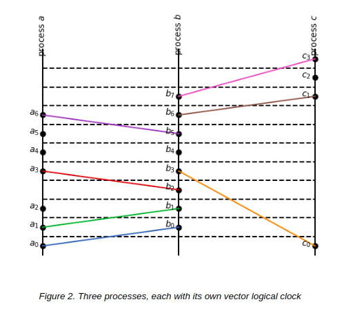

# ds-lab-08
Repository for the lab 8 assignment.

Lamport Timestamps and Vector Clocks algorithms implemented in Python for the situation shown on the image below

<p align="center"></p>

To run:

```
python3 lamport.py
python3 vector_clocks.py
```

Code was taken and adopted for the assignment purposes from [here](https://towardsdatascience.com/understanding-lamport-timestamps-with-pythons-multiprocessing-library-12a6427881c6).
